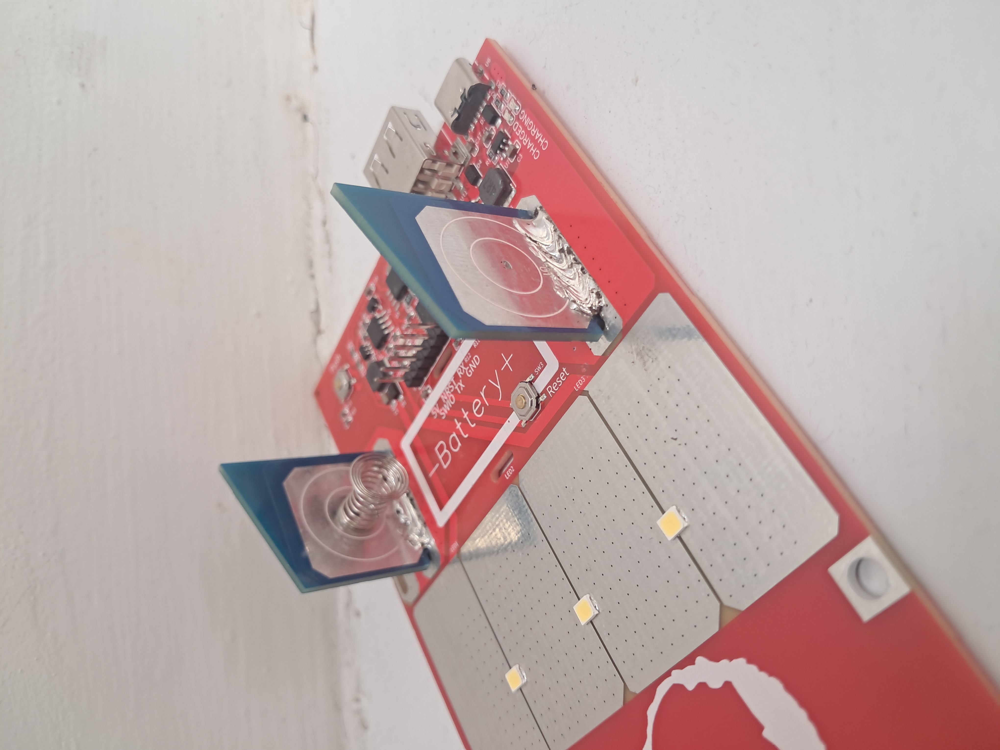
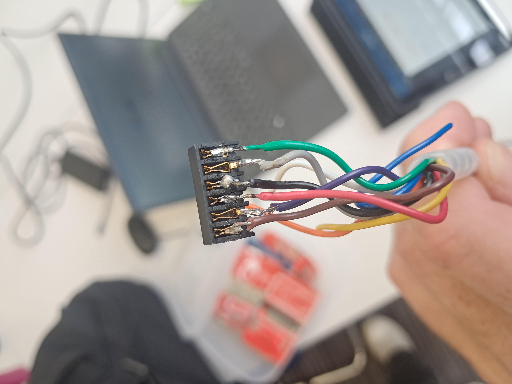
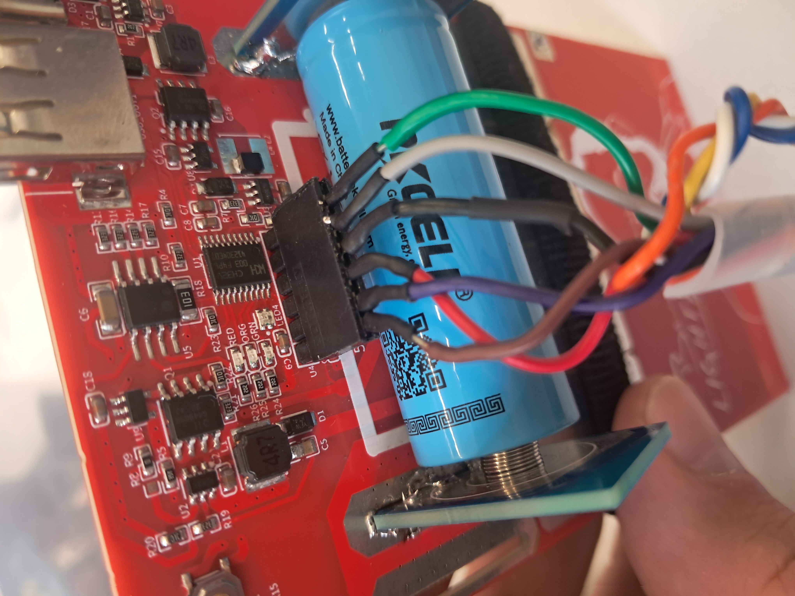
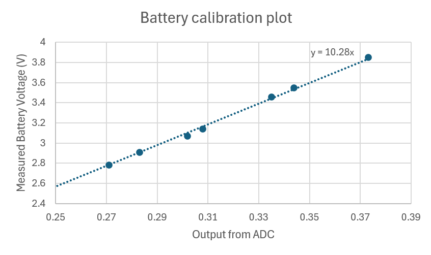

### Discussion with Noam 
The meeting we had with Noam highlighted where Beny lights fit into the market of solar lighting in Ethiopia. 

1. Competitors such as D light import entire products and are thus exposed to incredibly high import taxes. Whereas for Beny lights the components are imported as raw materials and assembled in Ethiopia meaning a lower bracket of import tax.
2. Additionally Beny lights is a not for profit entity

Noam expects these factors to be able to provide this lighing solution at around 50% of competitor prices

### WCH Link and soldering 
soldering was required on the boards in order to electrically connect the battery to test the lights. These connections also provide resting position
for the light so need to be strong.

 

We encountered issues with the link that flashes from moun studio to the board. The link was provided with connection soldered to crimp connectors rather than using the appropriate stackable header. So this was sourced from the stores and soldered with heat shrink which has so far provided a more reliable
link to the board.

 

 

### Battery status
Following from working out how to recieve data from the multi channel ADC we then had to implement this so to show the battery status using the three LEDs.
Noam instructed us to show the battery status for ten seconds once the button is pressed as well as this changing the light level.

To achieve this: 
1. We first needed to calibrate what we recievd from the Multichanel ADC so taking the 5 bit number divide by 1024 and scale by some value. We calculate this value dy draining the battery and sequentially comparing the actual voltage measured by a voltmeter to the Multichannel ADC value using printf and serial moniter.

 from the graph we see the trend is linear (this was a relief) with a scaling constant of 10.28 which once implemented to the code gave accurate voltage values.

 2. To implement the status upon button press, add a counter variable: batcount which increases each loop and resets to zero if the button is pressed

         if(!KeyPressed)
        {
            KeyTimePress = KEY_PRESS(KeyTimePress,KeyMinPressCalc);
            if(KeyTimePress == KeyMinPressCalc )
            {
                KeyPressed = 1;
                batcount = 0;

                if(LEDmode<LED_steps)
                {
                    LEDmode++;
                }
                else LEDmode = 0;
            }
        }

 Then add if statument into main code to display battery status until counter exceeds certain value which can be tuned depending on the clock speed.

                if (batcount<statusledtime){

                    if(calculateVoltage(ADCBuffer[2])>lowbat)
                    {
                        GPIO_WriteBit(GPIOC, RED, Bit_SET);
                    
                    
                        if (calculateVoltage(ADCBuffer[2])>midbat)
                        {
                
                    
                            GPIO_WriteBit(GPIOC, YLW, Bit_SET);

                            if (calculateVoltage(ADCBuffer[2])>fullbat)
                            {
                                GPIO_WriteBit(GPIOC, GRN, Bit_SET);
                            }
                    
                        }

                    }
                }
                else {
                    GPIO_WriteBit(GPIOC, RED, Bit_RESET);
                    GPIO_WriteBit(GPIOC, YLW, Bit_RESET);
                    GPIO_WriteBit(GPIOC, GRN, Bit_RESET);
                }

3. The Led status was simple to implement with comparitors to the calibrated voltage such that above certain threshold the red led was on, another threshold for the orange and another for the green.

## Updated Timeline
### Sleep Mode
### Sun Detection
### RGB if time permits

