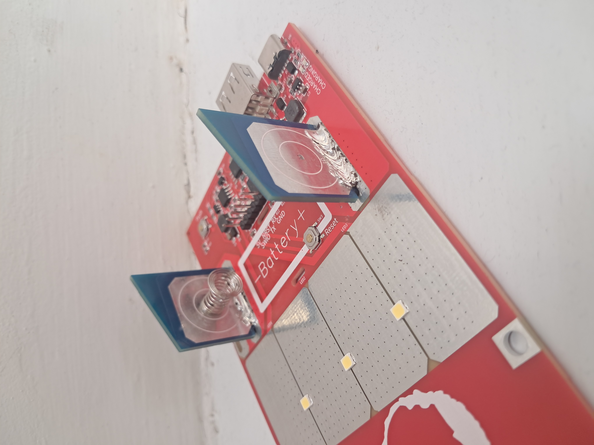
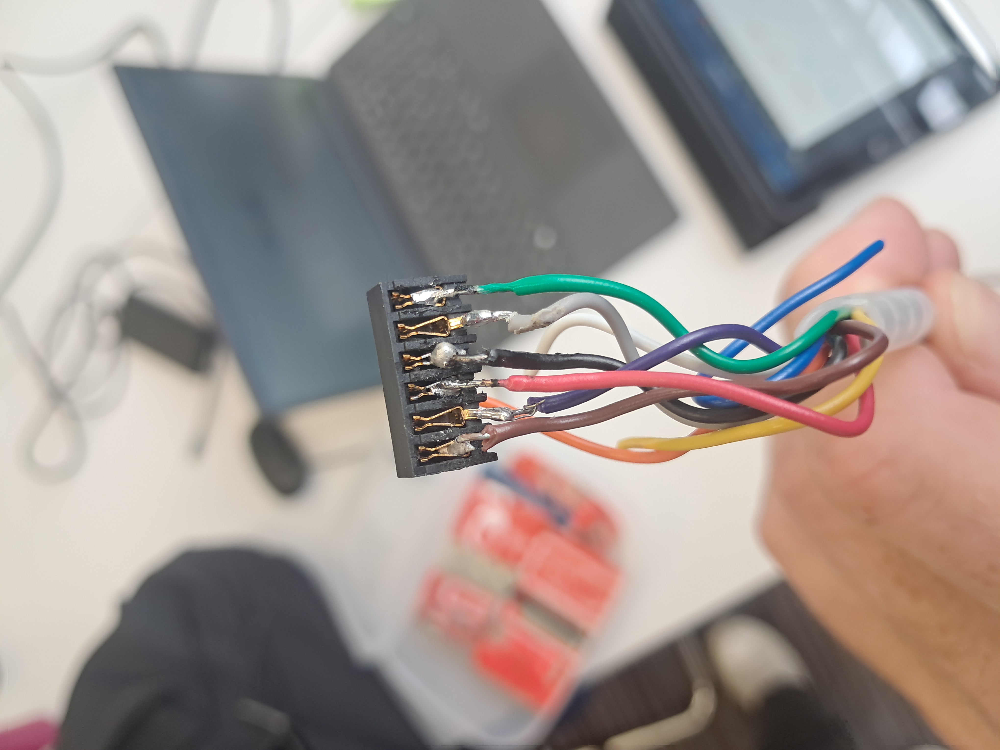

# Electrical Interim Report

## Follow Up Meeting with Noam
- Following feedback from our proposal presentation, we met again with Noam to redefine our expectations for the project.
- Because the project appears complicated, it was slightly overwhelming at the start and we were unclear on exactly what was required of us from a programming perspective. Having a second meeting after we had done some experimentation with the boards was very useful in helping us prioritise tasks and plan our workload.

- We established the following 4 main functionality requirements: 
    - When user presses the button, 3 LEDs show battery status for 10 seconds and LED brightness should increase in 4 steps
    - When sun detected, LED should be set back to 0%
    - When battery is below 3.2V, enter sleep mode. When battery is over 3.4V, exit sleep mode and wait for user.
    - When user presses RESET, enter sleep mode
    

## Technical Progress
We have been documenting each code draft in the **code** folder of our GitHub, where the README file clearly explains what progress has been made in each iteration of the code. 

Over the past week we mainly focussed on the first functionality requirement, which involves the 3 LEDs showing the battery status when the button is pressed. This required a clear understanding of the circuit diagram and measurement of the battery voltage using a multichannel ADC. We expect the next few tasks to be quicker than this one, because now all of the initialisation work has been done the next few tasks should be simpler to implement. 

### RGB LED
#### Objectives
- WS2812 LED is a programmable LED, aiming to replace the 3 separate red, orange and green LEDs.
- Controlled by input data stream of 24 bits, 8 bits for red, 8 bits for green, 8 bits for blue.
- Precise timing is required to send the colour signals.

*Images sourced from https://lastminuteengineers.com/ws2812b-arduino-tutorial/*

#### Difficulties Faced
 - The precise timing of the on/off signals is very difficult to achieve with limited programming experience and time. 
 - The library on Github is difficult to implement for a single LED, because it is written for a strip of LEDs so lots of the code can be removed. 
 - Integrating the LED code with the bigger board must be done before testing, otherwise the bigger board will blow when a battery is inserted.
   
#### Outcome
 - There is one demo code on GitHub containing the header files with functions that allow the light up, so by changing the pins and ports in this code, we managed to get the RGB LED to light up. This can be found in the **RGB LED** folder in our **code** folder.
 - This can be revisited at the end of the project if time permits.

### Multichannel ADC 
In order to read the voltage across the battery, we needed to use the microcontroller to read the value of FB_BAT (battery feedback). The code Noam gave to us utilized a single channel ADC, but this was already being used to control the USB voltage using PWM_USB. This control system stops the inductor overheating and melting so we could not overwrite this single channel ADC. 

We instead introduced a new 4 channel multichannel ADC which allows us to read all 4 channel voltages at once.

#### ADC_MultiChannel_Init
There are 4 sampling channels available from the circuit diagram which we can access with the microcontroller by initialising a multichannel ADC. 
  - FB_USB (PC4/A2) Channel 1
  - FB_SOLAR (PA2/A0) Channel 2
  - FB_BAT (PD4/A7) Channel 3
  - FB_ILED (PD3/A4) Channel 4

#### Printing the Values using **printf()**
- *Challenge*: You cannot print a float directly using the **printf()** function in C
- *Solution*: Use the following code to split the float into two **int** types and print them so they appear like a float

            int wholePart = (int)calibratedBAT;
            int decimalPart = (int)((calibratedBAT - wholePart) * 10000);
            printf("FB_BAT : %d.%04d ", wholePart, decimalPart);

#### Returning Multiple Values from Single Function
- *Challenge*: After writing **printMultiChannelADC()** function, we realised each function in C can only return a single value
    -  This meant only 1 out of 4 channels could be returned as a float to be used in the circuit
    -  Worked when we only needed FB_BAT, but for next step in project we need FB_SOLAR, so this is problematic
- *Solution*: Rewrote the function as 4 separate functions, each returning a single float
    - The functions **printFB_USB()**, **printFB_SOLAR()**, **printFB_BAT** and **printFB_LED()** can now be separately called and each returns the associated value which will be used in future code.
   

### Board Breakages
This part of the circuit shows a boost converter, where the duty cycle is controlled by the PWM_USB input signal. The inductor is sensitive to current and will overheat if the maximum current is exceeded, so it is important to limit this current. 

*Boost converter circuit image from https://www.allaboutcircuits.com/technical-articles/understanding-the-operation-of-a-boost-converter/*

#### Inductor Heating  

- *Challenge*: If the control code does not successfully regulate the current by controlling the PWM, the inductor current gets too large and the inductor can melt.
- When testing the RGB LED with the different code, there is no current control so when the battery was inserted, we blew the board. Provided a valuable learning lesson, so shouldn't make that mistake again!
- *Solution*: Change pins and parameters
    - When inspecting the output of the code on the serial monitor, we worked out that the ADC was originally connected to the rong pin, so the PWM was not successfully controlling the ADC output.
    - Limiting ADC value (**ADC_OV**) was decreased from 350 to 300.
    - By changing the pin and reducing the maximum allowable ADC raw value to 300, the current was kept to a low enough level that the inductor no longer overheated.
    - Only test the RGB code on the smaller boards (without a battery) to prevent damage to the bigger boards. 

#### Chip Destruction
When we connected the battery to one of the bigger boards, it began smoking because one of the chips was overheating. After some confusion, we noticed that the chip had actually been soldered incorrectly onto the board. This highlighted an issue in the PCB manufacturing, so we may need to look into methods of control checking the boards so this doesn't happen again. This is concerning because we only now have 3 remaining functional big boards. 

#### Explosive Batteries?! (False Alarm)
- *Challenge*: When measuring the voltage across our "3.7V" rechargeable batteries, the voltmeter read 5.2V for all fully charged batteries.
    - This is well above the safety limit for these batteries, so we initially panicked and thought we had received faulty batteries that could explode any second. 
- *Solution*: The multimeter was faulty, so using another multimeter gave the expected value of around 3.6V.
    -  Lesson learned: don't trust all equipment and think outside the box to solve problems.    

### Personal Development
- Familiarisation with coding, technical ability improved
- Less overwhelmed with the whole project: breaking it down into manageable steps improves productivity
- Problem solving ability improved, faced several challenges but learnt lots from each one

## How is BenyLIGHTs unique?
The meeting we had with Noam highlighted where Beny lights fit into the market of solar lighting in Ethiopia. 

1. Competitors such as D light import entire products and are thus exposed to incredibly high import taxes. Whereas for Beny lights the components are imported as raw materials and assembled in Ethiopia meaning a lower bracket of import tax.
2. Additionally Beny lights is a not for profit entity

Noam expects these factors to be able to provide this lighing solution at around 50% of competitor prices

### WCH Link and soldering 
Soldering was required on the boards in order to electrically connect the battery to test the lights. These connections also provide resting position
for the light so need to be strong.

 

We encountered issues with the link that flashes from MounRiver Studio to the board. The link was provided with connection soldered to crimp connectors rather than using the appropriate stackable header. So this was sourced from the stores and soldered with heat shrink which has so far provided a more reliable
link to the board.

 

 

### Battery status
Following from working out how to recieve data from the multi channel ADC we then had to implement this so to show the battery status using the three LEDs.
Noam instructed us to show the battery status for ten seconds once the button is pressed as well as this changing the light level.

To achieve this: 
1. We first needed to calibrate what we recievd from the Multichanel ADC so taking the 5 bit number divide by 1024 and scale by some value. We calculate this value dy draining the battery and sequentially comparing the actual voltage measured by a voltmeter to the Multichannel ADC value using printf and serial moniter.

From the graph we see the trend is linear (this was a relief) with a scaling constant of 10.28 which once implemented to the code gave accurate voltage values.

 2. To implement the status upon button press, add a counter variable: batcount which increases each loop and resets to zero if the button is pressed

         if(!KeyPressed)
        {
            KeyTimePress = KEY_PRESS(KeyTimePress,KeyMinPressCalc);
            if(KeyTimePress == KeyMinPressCalc )
            {
                KeyPressed = 1;
                batcount = 0;

                if(LEDmode<LED_steps)
                {
                    LEDmode++;
                }
                else LEDmode = 0;
            }
        }

 Then add if statement into main code to display battery status until counter exceeds certain value which can be tuned depending on the clock speed.

                if (batcount<statusledtime){

                    if(calculateVoltage(ADCBuffer[2])>lowbat)
                    {
                        GPIO_WriteBit(GPIOC, RED, Bit_SET);
                    
                    
                        if (calculateVoltage(ADCBuffer[2])>midbat)
                        {
                
                    
                            GPIO_WriteBit(GPIOC, YLW, Bit_SET);

                            if (calculateVoltage(ADCBuffer[2])>fullbat)
                            {
                                GPIO_WriteBit(GPIOC, GRN, Bit_SET);
                            }
                    
                        }

                    }
                }
                else {
                    GPIO_WriteBit(GPIOC, RED, Bit_RESET);
                    GPIO_WriteBit(GPIOC, YLW, Bit_RESET);
                    GPIO_WriteBit(GPIOC, GRN, Bit_RESET);
                }

3. The Led status was simple to implement with comparitors to the calibrated voltage such that above certain threshold the red led was on, another threshold for the orange and another for the green.

 
 

## Updated Timeline
### Sleep Mode
### Sun Detection
### RGB if time permits

