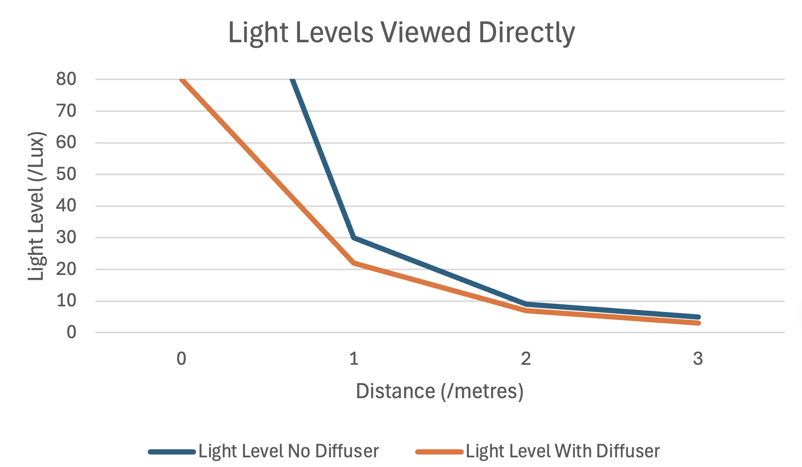
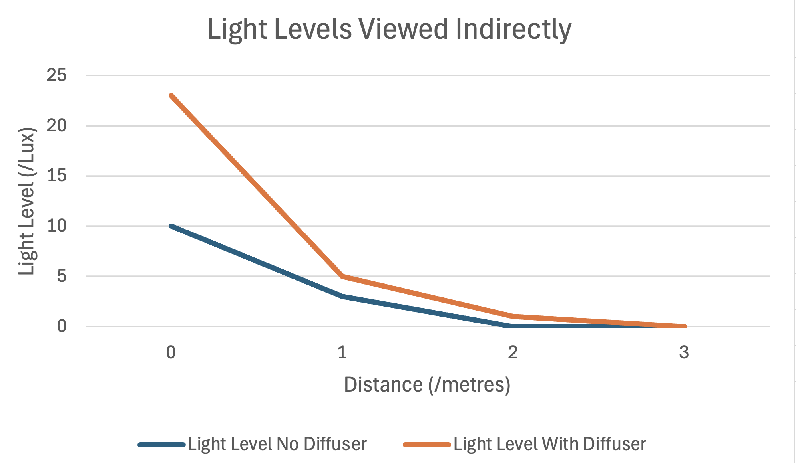

# Mechanical Interim Report

To be covered (brackets denote who is speaking):
Progress so far - case design (Leo), case modified to be curved (Leo), case printed and tested in the Supersonic Wind Tunnel lab (Leo)
Progress so far - 3D printing issues, supports needing to be removed, weighing up curved vs straight edges, the problem with the extra material (Samuel)
Show prototype so far (Leo)
Update project timeline, and explain what is to come (Samuel)

## Case Design

A case model was needed to be made in CAD which satisfies the design requirements outlined at the start:  
-Maximum diffusion at 180o  
-Loops for string  
-Cover the electronics  
-Geometrically sound  
-Allow the solar panel to sit at a favourable angle  
-Allow easy replacement of the battery

The first step was to measure the board for its size and the locations of the salient components.  

Next the board was modelled in CAD

Then a simple case design was made to test geometry and to serve as a base for any future designs.  

The design was then tested with the PCB model.  

That was then printed and used to determine flaws to fix in newer iterations such as:  
-Missing window above the lights  
-Missing slots  
-Diffusion suboptimal  
-USB holes too small  
-Did not allow the panel to sit at the right angle  

The best shape for a diffuser is a sphere.  

With this in mind, a new case was designed using the old one.

This is the latest version to be printed but is not perfect:  
-Printing faults  
-Not enough loops  
-Shape could still be optimised
-Clips could be designed and incorporated  
-Dust resistance can be improved  
-Better battery stability  

However, the potential for a kickstand as stated in the proposal is now seen to be unnecessary.  

Currently the material is simply the only one available to us, whether this is the best option still needs to be investigated.  
The case also needs to be stress tested.  For example:  

## Light diffusion test

Went to supersonic wind tunnel lab, where the blinds could be draw to eliminate light, to test the device.

Used a light meter built into a phone to test the light levels at varying distances.

Diffuser showed good effectiveness, both at reducing the intenisty of light directly ahead of the lights and at increasing the intensity of light at angles perpendicular to the board.

Qualitatively, it was easier to read a book when the diffuser was attached, and shadows had less sharp edges.

## 3D Printing

STL export issues caused parts of the print to invert (fill when they shouldn't, not fill when they should)

We redesigned the Solidworks parts to remove what we thought might be overlapping lines on the STL. This created a successful render.

Ths created a successful 3D print.

## Printing Industrially

In addition to creating files, we need to find the best way of cost-effectively printing them. This may involve research into the best way to print files, or possibly even commissioning an in-house printer if there is no more effective method. Some mainstream printing companies can be expensive, so we need to find an effective way to bulk order 3D prints.

## Next Steps

There are a few key missions to complete before the case is ready to ship.

#### Secure attachment points

#### Reducing amount of support material required

#### Assessing best method for industrial printing

#### Prepare for industrial print

## Timeline

