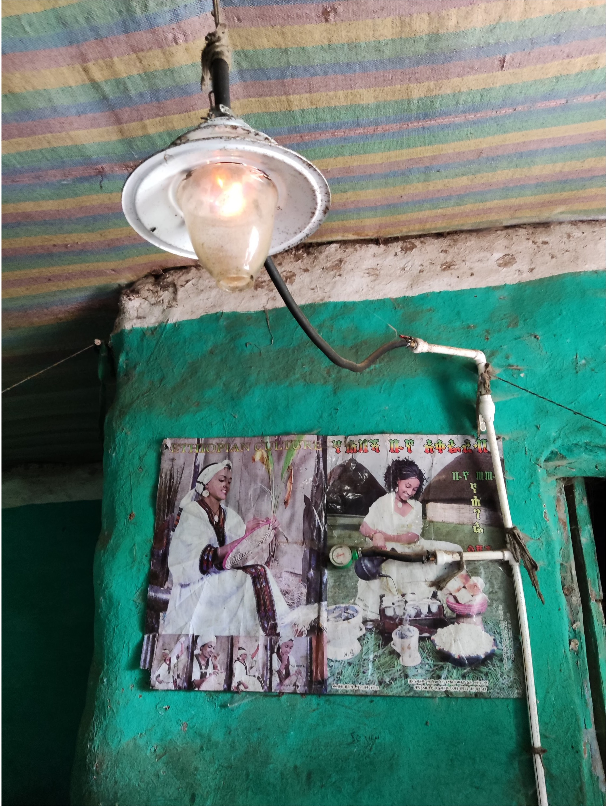

# Problem description

Brief overview of the problem, context and engineering approach to tackle the problem.

## Problem in Context: Rural Lighting in Ethiopia

- 43.6% of rural Ethiopia has no access to electricity, so rely on kerosene lamps for lighting, which cause indoor pollution and health risks 1
    - Inhaling the fumes from kerosene lamps is equivalent to smoking several packets of cigarettes daily 2
    - Respiratory diseases caused by kerosene lamps decrease life expectancy 3
    - Kerosene lamps emit 'black carbon', which contributes to global warming 3
 
 
  
- **Electrification** and the access to light which it brings has a **positive** impact on the **Human Development Index** 4
  - Electrification improves life expectancy and education within a country 4

https://www.modernghana.com/news/1381887/why-solar-lanterns-and-shs-failed-in-ethiopia.html

There have been previous attempts to electrify rural villages but one of the main issues is that when something breaks, there is nobody to fix it. 

## Engineering Solution

We are building an **affordable** and **scalable** solar powered light source for domestic use, to replace Kerosene lamps.

A prototype board has already been designed and built by our supervisor, Noam, and the aim of our project is to further develop the product.

- Current Issues:
    - Exposed electronics
      - Current exposed electronics are more susceptible to dust and damage, decreasing expected lifespan of the product
    - Inefficient LEDs
      - Currently 3 Red, Orange, Green LEDs to display battery level
    - Harsh, undiffused light
      - Very bright to look at, risk of damaging the eyes   
    - Needs a discrete boost to replace IC
      - ICs can be expensive

# Presentation of the proposal

Technical aspects may be described here.
There are two main components to the project, the mechanical and electrical sides. 

## Mechanical:  
### Case Design:  
(): Possible but not necessary implementations  
**design constraints in bold**
- **Loop for hanging** (clips for clipping)
- Diffusing transparent plastic cover
- **Slots for the USBs**
- Kick stand to angle the panel perpendicular to sun rays
- Dust resistant (dust covers for the ports)
- **Cheap**
- **3D printable**
- Acyrlic/ PMMA likely material to be used

## Electronics:  
There are 2 main electrical improvements to be made:

### Implement RGB LED
  - Individual red, orange and green LEDs waste power
  - There is already a WS2812 LED on the PCB, but it is currently not programmed
  
### Replace Integrated Circuit with Boost Converter
 - Current driver is UCC2751x, which is a high performance, expensive chip from Texas Instruments
 - Aim to replace with discrete boost system using RY3730 chip, designed for low performance, budget applications
   
### Cost Reduction Challenges
- The CH32V003F4P6 is cheaper than Arduino, but less popular so less libraries: code from scratch
- The WS2812 LED is usually programmed as a strip, so programming one individual component is less well documented
- Cheaper components require more programming skill to successfully integrate, the cheaper chip only has basic features and lacks the protection systems of the more expensive one. 

Reducing the cost doesn't decrease the quality of components, it increases the difficulty of the programming for us!

# Assessment of the quality of the proposal

Evaluate its value in the context of the project. 
What will it solve, is it safe, etc. Check Lara’s slides for what to cover.
-
- Responsible
    - Printed Circuit Boards are manufactured with different material compositions and are intrinsically complex generating multiple challenges at end of 
      life6
    - Recycling of the lithium ion batteris brings challenges as the contents are difficult to separate unlike lead acid batteries 
    - Single purchase/donation therefore no committing payment plan for the lighting solution
- Genuine need
    - Light in the home enables more flexible working hours allowing for breaks during hottest parts of the day 3
    - facilitates productive work in the evening freeing up daytime hours for other income streams3
- Adds significant value
    - existing products are more expensive
    - solar infrastructure and hubs is desired end goal however time frame for implementation is longer
- Accessible
    - Self sufficient product, can be rapidly implemented without new infrastructure requirements
    - Noam is planning to donate the boards to local sellers, may have to consider 15% import tax 5
    - Parts produced in China, assembled in Ethiopia
- Context appropriate
    - Ethiopia has a high solar potential of 5.2KWh/m2/day6
    - Rechargeable battery: does not require grid connection so suitable for rural setting
    - Requirement of 4 hours 40 minutes battery life, to meet local requirements with annually invariant daylight
    - Potentially better to make higher quality, but more robust/repairable could increase cost (tradeoffs)
    - Repairability concerns: soldering is easier for in factory repair, but bolts would be easier to repair in home

# References
 1. World Bank Open Data. (n.d.). World Bank Open Data. https://data.worldbank.org/indicator/EG.ELC.ACCS.RU.ZS?end=2023&locations=ET&start=2008
 2. Clair, B. (2022, February 1). Impact of kerosene — PowerWells. PowerWells. https://www.powerwells.org/blog/blog-post-title-three-babra#:~:text=The%20use%20of%20these%20fuels,smoking%2040%20cigarettes%20per%20day.
 3. 2023 Unfccc.int. Available at: https://unfccc.int/climate-action/momentum-for-change/activity-database/momentum-for-change-solar-lighting-in-rural-ethiopia (Accessed: 21 May 2025).
 4. Da Silveira Bezerra, P. B., Callegari, C. L., Ribas, A., Lucena, A. F. P., Portugal-Pereira, J., Koberle, A., Szklo, A., & Schaeffer, R. (2017). The power of light: socio-economic and environmental implications of a rural electrification program in Brazil. Environmental Research Letters, 12(9), 095004. https://doi.org/10.1088/1748-9326/aa7bdd
 5. Ethiopia - import tariffs. (2024, January 18). International Trade Administration | Trade.gov. https://www.trade.gov/country-commercial-guides/ethiopia-import-tariffs
 6. Bekele Mulatu, A., Ayall Negash, W. and Teshome, M. (2023) ‘The status of solar energy utilization and development in Ethiopia’, American Journal of Applied Scientific Research [Preprint]. doi:10.11648/j.ajasr.20230903.13. 
 7. Patil, T., Rebaioli, L. and Fassi, I. (2022) ‘Cyber-physical systems for end-of-life management of printed circuit boards and Mechatronics Products in home automation: A Review’, Sustainable Materials and Technologies, 32. doi:10.1016/j.susmat.2022.e00422. 
