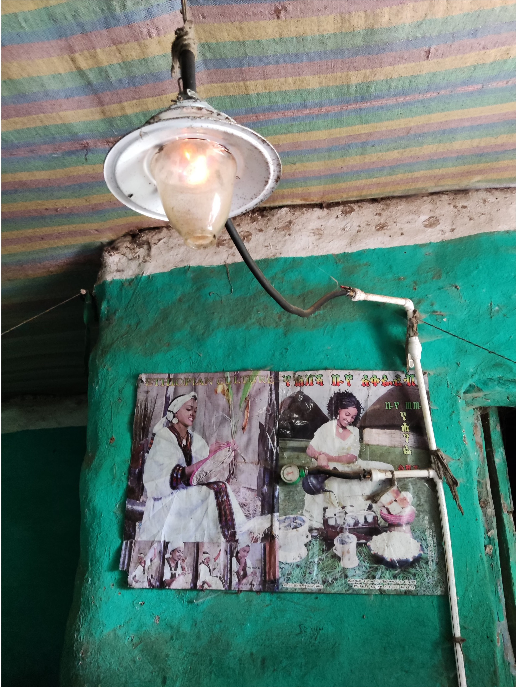

## The Problem: Rural Lighting in Ethiopia

- 43.6% of rural Ethiopia has **no access to electricity** so rely on **kerosene lamps** for lighting which cause indoor pollution and health risks 1
    - Inhaling the fumes from kerosene lamps is equivalent to smoking several packs of cigarettes a day 2
    - **Respiratory diseases** caused by kerosene lamps decrease life expectancy 3
    - Kerosene lamps emit **'black carbon'** which contributes to global warming 3
 
 
  
- **Electrification** and the access to lighting have a **positive** impact on the **Human Development Index** 4
  - Electrification improves life expectancy and quality of life within a country 4

There have been previous attempts to electrify rural villages, however, when something breaks there is most likely no-one there to fix it. Implementation of the grid in Ethiopia will take a long time and lots of money, so Beny LIGHTS is an instant solution.  

## The Solution: Beny LIGHTs

### Starting Point

At the start of this project, we had a PCB with no case and which only had very basic functionality. The LEDs were too bright to look at with the naked eye and the coloured LEDs simply counted up in binary, providing no meaningful information. Over the four weeks of this project, we have designed and prototyped a case that both protects the electronics and diffuses light effectively. We have programmed the user interface of the board, so that the battery charge level can be displayed by the coloured LEDs, so the board now functions as intended by Noam. We also investigated some energy saving measures like introducing sleep mode and sun detection to minimise unnecessary power usage.

The light has the following features, and each feature has a link to it's technical implementation. 

#### Button Functionality
- Button press [increases LED brightness](Lucy.md) in steps
  - Reduced maximum brightness from 100 to 60 to stop browning out
- Button press also shows battery voltage on red, orange, green LEDs
  - Multichannel ADC (Lucy) <- maybe move this to Jim's section bc it fits better here
  - Calibration (Jim)
  - batcount (Jim)
  - averaging (Jim)

#### Power Conservation
- Sleep mode when battery voltage drops below 3.2V (Lucy)
- Sleep mode after 2 minutes of LEDs on zero brightness
- Sun detected the LED mode sets back to zero to save energy
  - averaging: issues when battery drops to 0V if bad connection: sleep when it's not supposed to
  - Button interrupt and __WFI()
  - Need extra button for actual useful product (unrealistic to remake PCB in 4 weeks but will feedback to Noam)
  - Currently uses periodic wakeup and standby mode as proof of concept

#### Mechanical Case Design
Basic mechanical case design to be outlined here and links to individual webpages

## Sustainable Development Goals Alignment

Throughout the project, we ensured that our work aligned with the sustainable development goals and Lara's slides from the beginning of the project. [This page](reflective_discussion.md) contains more information about how our project meets these key expectations. 

## Project Management

The progress made in this projhect ws a direct result of an effective teamwork strategy and efficient planning. A more detailed account of our project management strategy, written by Samuel, can be found on [this page](project_management.md).  

